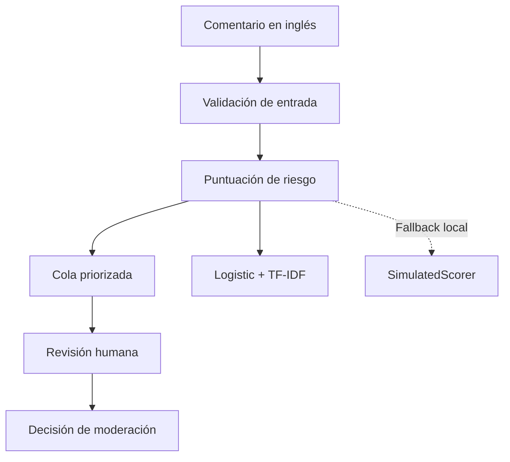

# Moderación asistida de comentarios

### Priorización de revisión humana mediante NLP y Machine Learning

[](https://github.com/Bootcamp-IA-MAD-P7/proyecto9-grupo3/actions/workflows/harness.yml)


## Qué es

Es una aplicación de moderación asistida para organizar comentarios y ayudar a una persona moderadora a decidir cuáles revisar primero. Calcula una puntuación de riesgo orientativa, muestra una cola priorizada y permite consultar el texto completo solo a usuarios autenticados y autorizados.

Está pensada para equipos de moderación que necesitan revisar muchos comentarios de forma ordenada y trazable. El MVP trabaja con comentarios en inglés y utiliza `IsToxic` como referencia de alcance; esta etiqueta no cubre por sí sola gravedad, violencia, discurso de odio ni todas las políticas de una plataforma.

## Qué problema resuelve

Revisar comentarios solo por orden de llegada puede retrasar los casos que necesitan atención. El sistema usa una señal estimada para ordenar la cola y ayudar a la persona moderadora a priorizar su trabajo.

## Qué hace y qué no hace

Hace lo siguiente:

- Importa y valida lotes de comentarios.
- Calcula riesgo e incertidumbre y ordena una cola pendiente.
- Oculta el texto completo en la cola y lo muestra solo en el detalle autorizado.
- Permite registrar `NEEDS_REVIEW`, `CONFIRMED_TOXIC` o `NOT_TOXIC`, con notas opcionales.
- Guarda usuario, fecha, estado y decisión de la revisión.
- Aplica autenticación y roles `MODERATOR` y `SUPERVISOR`.

No elimina, bloquea, denuncia ni sanciona comentarios; no se conecta a YouTube; no funciona en tiempo real; no clasifica sentimientos ni interpreta automáticamente políticas externas. La puntuación no es una decisión automática ni una certeza: solo sirve para priorizar y la decisión final siempre la toma una persona moderadora.

## Cómo funciona



1. `SUPERVISOR` importa un lote.
2. La API valida y puntúa cada comentario.
3. La cola devuelve los pendientes sin texto.
4. La persona moderadora consulta el detalle autorizado.
5. Registra una decisión humana y, opcionalmente, una nota.

## Ejecutar con Docker

Requisitos: Docker Desktop con Docker Compose v2.

```bash
docker compose up --build
```

- Frontend: http://localhost:5173
- Swagger: http://localhost:8000/docs
- OpenAPI: http://localhost:8000/openapi.json

Compose ejecuta FastAPI en `8000`, React servido por Nginx en `5173` y conserva SQLite en el volumen `moderation-data`. El backend permite CORS desde `http://localhost:5173`.

Variables configurables:

```bash
BACKEND_PORT=8000 FRONTEND_PORT=5173 VITE_API_URL=http://localhost:8000 docker compose up --build
```

En PowerShell:

```powershell
$env:BACKEND_PORT = "8000"
$env:FRONTEND_PORT = "5173"
$env:VITE_API_URL = "http://localhost:8000"
docker compose up --build
```

### Usuarios demo y prueba de la demo

Con los contenedores levantados, crea los usuarios. El comando solicita las contraseñas de forma oculta y no las guarda en Git:

```bash
docker compose exec backend python -m app.seed_demo_users
```

Los usuarios son `moderator` (`MODERATOR`) y `supervisor` (`SUPERVISOR`). Si ya existen, sus credenciales se conservan.

Si una cuenta ya existe y necesitas elegir una contraseña nueva, restablécela explícitamente desde el mismo entorno que contiene la base configurada. El comando solicita y confirma la contraseña sin mostrarla, guarda solo su hash Argon2 y revoca sesiones previas; nunca se ejecuta al arrancar:

```powershell
cd backend
$env:MODERATION_DATABASE_PATH = "C:\ruta\a\la\base\moderation.db" # omite esta línea si usas backend/data/local/moderation.db
python -m app.reset_user_password moderator
python -m app.reset_user_password supervisor
```

Con Docker, para la base del volumen local: `docker compose exec backend python -m app.reset_user_password moderator` (y repite para `supervisor`). No ejecuté estos comandos contra producción. En este proyecto no hay un volumen gestionado ni permisos de producción documentados; el despliegue necesitaría una consola segura con acceso a la misma base, o una infraestructura equivalente, antes de poder restablecer credenciales allí.

La portada está en http://localhost:5173/, la demo pública en http://localhost:5173/demo y el acceso privado de moderadores en http://localhost:5173/moderator. La demo acepta enlaces HTTPS de `youtube.com` y `youtu.be` y consulta el endpoint público del backend. Si falta `MODERATION_YOUTUBE_API_KEY`, el error se muestra de forma explícita y se puede abrir un modo de ejemplo con datos sintéticos claramente etiquetados; no se simula una carga real.

Para habilitar comentarios reales, crea una API key en Google Cloud, habilita **YouTube Data API v3** y configura únicamente en el servidor o en el entorno Docker:

```bash
MODERATION_YOUTUBE_API_KEY=...
MODERATION_YOUTUBE_MAX_RESULTS=50
```

La clave nunca se expone al frontend. El backend valida el dominio, esquema e ID del vídeo, aplica un límite temporal por cliente y convierte los errores de vídeo no disponible, comentarios desactivados y cuota agotada en mensajes comprensibles. La actualización se realiza al volver a enviar el enlace y muestra la hora de la última respuesta.

Para importar comentarios sintéticos, abre Swagger, ejecuta `POST /auth/login` con `supervisor`, pulsa **Authorize** y pega `Bearer <access_token>`. Después ejecuta `POST /comments/import` con:

```json
{
  "items": [
    {"comment_id": "docker-demo-1", "video_id": "video-demo", "text": "This is a synthetic comment for the moderation queue."},
    {"comment_id": "docker-demo-2", "video_id": "video-demo", "text": "This synthetic comment contains an insulting phrase for review."}
  ]
}
```

Después inicia sesión en el frontend, consulta un detalle y registra una decisión humana.

## Desarrollo local sin Docker

### Backend

Requisitos: Python 3.12+.

```powershell
python -m venv .venv
.\.venv\Scripts\python.exe -m pip install -c backend/constraints.txt -e ".[dev]"
.\.venv\Scripts\python.exe -m app.seed_demo_users
.\.venv\Scripts\python.exe -m uvicorn app.main:create_app --factory --reload --host 127.0.0.1 --port 8000
```

Swagger: http://127.0.0.1:8000/docs. En un `.env` local e ignorado por Git puede definirse `MODERATION_CORS_ORIGINS=["http://localhost:5173"]`.

### Frontend

En `frontend/.env` define `VITE_API_URL=http://127.0.0.1:8000` y ejecuta:

```powershell
cd frontend
npm install
npm run dev -- --host localhost --port 5173
npm run build
npm run lint
```

## Tecnologías

Python 3.12+, FastAPI, Uvicorn, Pydantic Settings, SQLite, `pwdlib`/Argon2, React, TypeScript, Vite, Nginx, Docker Compose, scikit-learn, Joblib y Pytest.

## Modelo

El candidato productivo es Logistic Regression + TF-IDF. Cuando existe el artefacto validado, la API usa `model_version=logistic-tfidf-v1` y `score_source=MODEL`. `risk_score` es una probabilidad estimada y `uncertainty` mide la cercanía a `0,5`.

Si falta el artefacto, `SimulatedScorer` está permitido en demos y tests locales: usa `simulated-v1` y `SIMULATED`. Es determinista, pero no representa una predicción real de toxicidad. También se evaluaron SVM + TF-IDF y DistilBERT; el Transformer queda como experimento, fuera de producción.

## Endpoints principales

Swagger: http://127.0.0.1:8000/docs. Los endpoints protegidos usan `Authorization: Bearer <access_token>`.

| Endpoint | Permiso | Propósito |
| --- | --- | --- |
| `GET /health` | Público | Disponibilidad |
| `POST /auth/login` | Público | Crear sesión |
| `GET /auth/me` | Autenticado | Usuario actual |
| `POST /auth/logout` | Autenticado | Revocar sesión |
| `POST /comments/import` | `SUPERVISOR` | Importar lote puntuado |
| `GET /comments` | `MODERATOR`, `SUPERVISOR` | Cola sin texto |
| `GET /comments/{comment_id}` | `MODERATOR`, `SUPERVISOR` | Detalle autorizado con texto |
| `POST /comments/{comment_id}/review` | `MODERATOR`, `SUPERVISOR` | Registrar revisión humana |

Estados: `PENDING`, `IN_REVIEW`, `REVIEWED`. Decisiones: `NEEDS_REVIEW`, `CONFIRMED_TOXIC`, `NOT_TOXIC`.

```json
{"decision": "CONFIRMED_TOXIC", "notes": "Synthetic review note"}
```

`NEEDS_REVIEW` mueve `PENDING` a `IN_REVIEW`; una decisión final mueve `IN_REVIEW` a `REVIEWED`.

## Privacidad y seguridad

- La cola no devuelve el texto completo; el detalle requiere autenticación y rol autorizado.
- Las contraseñas se almacenan con hashes Argon2 y nunca en texto plano.
- Las sesiones del frontend viven en memoria, no en `localStorage` ni `sessionStorage`.
- `.env`, credenciales, SQLite, datos locales y artefactos de modelos están excluidos de Git.
- CORS se limita al origen del frontend.
- Las revisiones quedan asociadas a usuario y fecha.
- Las notas no deben incluir credenciales ni datos sensibles.

## Estado y limitaciones

El vertical local está implementado: API con autenticación, roles, SQLite, cola y revisiones; frontend React/Vite conectado; Docker Compose; volumen SQLite; fallback local; y pruebas automatizadas.

La validación actual incluye `150 passed`, `npm run build`, `npm run lint`, `docker compose config` y `git diff --check`.

Limitaciones: SQLite y el fallback simulado no son soluciones de producción; el modelo necesita su artefacto validado; la demo pública no registra decisiones reales y no ejecuta acciones contra YouTube; faltan HTTPS terminado en infraestructura, gestión de secretos, observabilidad, copias de seguridad, retención y controles operativos. La accesibilidad requiere auditoría manual con lector de pantalla y teclado.

```bash
python -m compileall -q backend/app src
git diff --check
```

## Estructura y documentación

```text
backend/app/                 API FastAPI, autenticación, comentarios y base de datos
backend/tests/               Tests de la API y revisiones
frontend/src/                Aplicación React/Vite
src/moderation/              Modelos y evaluación
scripts/                     Entrenamiento y comparación
docs/backend/                Documentación de API y demo
docs/model/                  Documentación de modelos y métricas
data/splits/                 Split común versionado
configs/                     Configuraciones de evaluación
```

- [Visión de producto](docs/product-vision.md)
- [Discovery](docs/product/DISCOVERY.md)
- [Primer endpoint](docs/backend/01-primer-endpoint.md)
- [Persistencia](docs/backend/02-base-de-datos.md)
- [Autenticación y permisos](docs/backend/03-autenticacion-y-permisos.md)
- [Carga y cola priorizada](docs/backend/04-carga-y-cola-priorizada.md)
- [Logistic + TF-IDF](docs/model/logistic-tfidf.md)
- [Ensemble](docs/model/ensemble.md)
- [Transformer](docs/model/transformer.md)
- [Resumen de métricas para la presentación](docs/presentation-metrics.md)

## Equipo

Proyecto desarrollado por **Fernanda**, **Gabriela** y **Arnaldo** durante el bootcamp de Inteligencia Artificial de Factoría F5.
