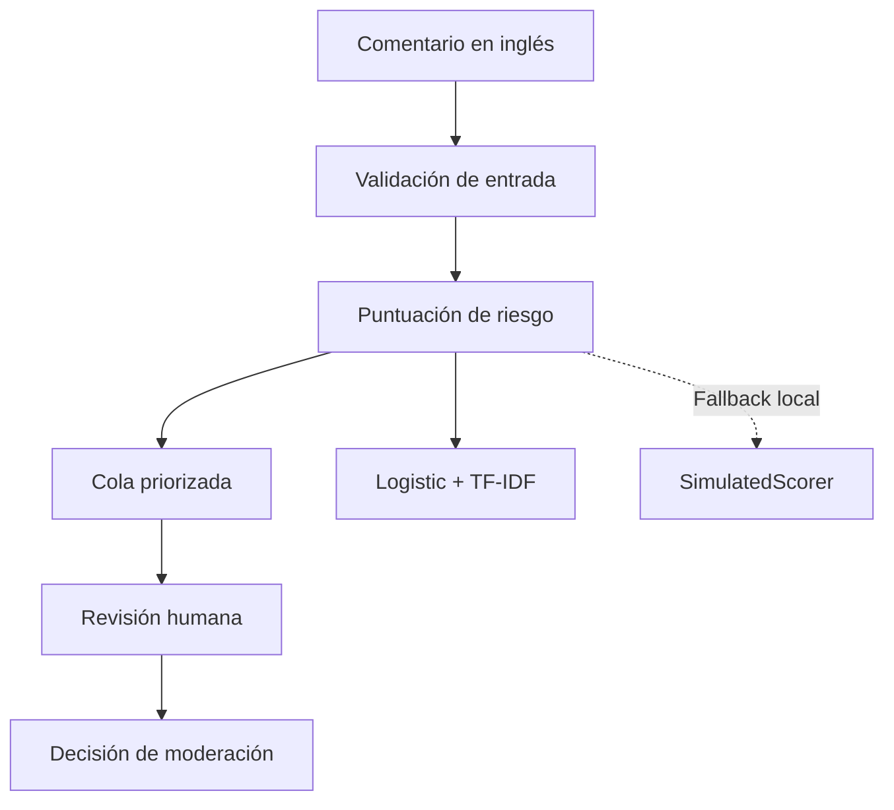

<div align="center">

# Moderación asistida de comentarios

### Priorización de revisión humana mediante NLP y Machine Learning

[](https://github.com/Bootcamp-IA-MAD-P7/proyecto9-grupo3/actions/workflows/harness.yml)


Una API interna que ayuda a priorizar comentarios potencialmente tóxicos para su revisión humana, sin delegar en el modelo la decisión final de moderación.

</div>

---

## Problema

La revisión de comentarios en orden de llegada puede retrasar casos que requieren atención prioritaria. Este proyecto explora si una señal de riesgo estimado de toxicidad puede ayudar a una persona moderadora a organizar su trabajo y decidir qué comentario revisar primero.

El MVP trabaja con comentarios en inglés y con la etiqueta `IsToxic`. Esta etiqueta sirve como señal de toxicidad para el alcance del proyecto; no mide por sí sola gravedad, violencia, discurso de odio ni cumplimiento completo de las políticas de YouTube.

## Propuesta de valor

El sistema permite:

- Importar y validar lotes de comentarios.
- Autenticar usuarios y aplicar permisos por rol.
- Asignar una señal de riesgo para ordenar una cola.
- Consultar la cola de forma paginada sin devolver el texto.
- Mantener la decisión final bajo control humano.

El sistema no:

- Elimina, bloquea, denuncia ni sanciona comentarios.
- Se conecta a YouTube ni opera en tiempo real.
- Clasifica sentimiento.
- Interpreta automáticamente políticas de moderación.
- Presenta una puntuación como una certeza.

## Flujo del MVP



> La API usa Logistic + TF-IDF cuando encuentra el artefacto validado. `SimulatedScorer` solo se conserva como fallback local cuando falta el artefacto y no representa toxicidad real.

## Estado del proyecto

| Área                                | Estado        | Evidencia                                                          |
| ----------------------------------- | ------------- | ------------------------------------------------------------------ |
| Problema, alcance y límites del MVP | Implementado  | [Visión de producto](docs/product-vision.md)                       |
| API FastAPI                         | Implementada  | `backend/app/`                                                     |
| Persistencia local                  | Implementada  | SQLite en `data/local/`                                            |
| Autenticación y roles               | Implementados | `backend/app/auth/`                                                |
| Importación y cola priorizada       | Implementadas | `backend/app/comments/`                                            |
| Demo HTTP local                     | Verificada    | [Guía de carga y cola](docs/backend/04-carga-y-cola-priorizada.md) |
| Evaluación de modelos               | Implementada  | [Guía del ensemble](docs/model/ensemble.md)                        |
| Modelo clásico candidato            | Seleccionado  | Logistic Regression + TF-IDF                                       |
| Inferencia real en la API           | Implementada  | `LogisticScorer`, versión `logistic-tfidf-v1`                      |
| Despliegue                          | Pendiente     | Posterior al vertical local completo                               |

## Demo funcional de la API

La API local está verificada con comentarios sintéticos.

| Comprobación                      | Resultado                    |
| --------------------------------- | ---------------------------- |
| `GET /health`                     | `200`                        |
| Login de `supervisor`             | `200` y rol `SUPERVISOR`     |
| Importación de tres comentarios   | `201`                        |
| Cola paginada                     | `200`, con páginas `2 + 1`   |
| Login de `moderator`              | `200` y rol `MODERATOR`      |
| Consulta de cola como `moderator` | `200`                        |
| Importación como `moderator`      | `403`                        |
| Repetición del lote               | `409`                        |
| Texto expuesto en la cola         | No                           |
| `score_source` / `model_version` | `MODEL` / `logistic-tfidf-v1` |

El orden de la demo proviene de la probabilidad del pipeline Logistic + TF-IDF. `risk_score` es una señal para priorizar revisión humana, no una decisión automática ni una certeza de toxicidad.

## Ejecutar la API local

Requisitos: Python 3.12 o superior.

```powershell
python -m venv .venv
.\.venv\Scripts\python.exe -m pip install -c backend/constraints.txt -e '.[dev]'
.\.venv\Scripts\python.exe -m app.seed_demo_users
.\.venv\Scripts\python.exe -m uvicorn app.main:create_app --factory --reload --host 127.0.0.1 --port 8000
```

Abre http://127.0.0.1:8000/docs para probar la API desde Swagger.

El comando de usuarios solicita contraseñas locales para `moderator` y `supervisor`. No uses credenciales compartidas ni las guardes en Git.

## Modelos evaluados

Los modelos se compararon sobre un split común por `VideoId`. El threshold se seleccionó únicamente con validation; el conjunto de test no se utilizó para seleccionar modelo, pesos ni threshold.

| Modelo                       | F1 validation | PR-AUC validation | Brier validation | Estado                            |
| ---------------------------- | ------------: | ----------------: | ---------------: | --------------------------------- |
| Logistic Regression + TF-IDF |        0,7306 |            0,7793 |           0,2166 | Candidato productivo seleccionado |
| SVM + TF-IDF                 |        0,7122 |            0,7398 |           0,2475 | Evaluado                          |
| Transformer DistilBERT       |        0,7734 |            0,8767 |           0,2060 | Experimento; fuera de producción  |

También se evaluaron combinaciones Logistic/SVM con pesos `100/0`, `75/25`, `50/50`, `25/75` y `0/100`.

La mejor combinación fue `75/25`, con F1 `0,7226` y Brier `0,2208`. No mejoró simultáneamente F1 y calibración frente a Logistic individual.

### Decisión de modelo

Se selecciona **Logistic Regression + TF-IDF** como candidato inicial para la inferencia productiva porque fue la mejor alternativa clásica evaluada y mantiene una complejidad operativa menor.

La API ya conecta el artefacto validado mediante `LogisticScorer`; si el artefacto
no está disponible, el fallback simulado solo se permite en demos/tests locales.

La inferencia productiva expone una interfaz de texto nuevo:

```python
score_comment(text: str) -> Score
```

El artefacto se carga una sola vez y contiene:

1. El vectorizador y el clasificador Logistic empaquetados.
2. Preprocesamiento reproducible y metadatos con hash.
3. Threshold seleccionado únicamente con validation; test cerrado.
4. `uncertainty` calculada como cercanía de la probabilidad a 0,5.

## Limitaciones del Transformer

El Transformer DistilBERT funcionó como experimento de entrenamiento y evaluación, pero no se seleccionó para producción debido a una señal clara de overfitting.

| Ejecución                       | F1 train | F1 validation |      Gap |
| ------------------------------- | -------: | ------------: | -------: |
| Línea base                      |   0,9639 |        0,7888 | 17,51 pp |
| `weight_decay` + early stopping |   0,9640 |        0,7734 | 19,06 pp |

La regularización probada no mejoró el resultado y aumentó el gap. El conjunto de test permaneció cerrado, por lo que no se declara cumplido el requisito de una diferencia train-test inferior al 5 %.

El Transformer queda documentado como experimento evaluado y no debe presentarse como modelo productivo de la demo.

## Validación

La última ejecución registrada del bloque de modelos fue:

```text
143 passed, 2 warnings, 2 subtests passed
```

Comprobaciones adicionales:

```bash
python -m compileall -q backend/app src
git diff --check
```

## Estructura relevante

```text
backend/app/                 API FastAPI, autenticación, comentarios y base de datos
backend/tests/               Tests de la API y del flujo de comentarios
src/moderation/              Código de modelos y evaluación
scripts/                     Entrenamiento y comparación de modelos
docs/backend/                Documentación de la API y la demo
docs/model/                  Documentación de modelos, métricas y limitaciones
data/splits/                 Split común versionado
configs/                     Configuraciones de evaluación
```

El dataset original, los artefactos locales, las bases SQLite, las credenciales y los archivos `.env` no se versionan.

## Documentación

* [Visión de producto](docs/product-vision.md)
* [Discovery](docs/product/DISCOVERY.md)
* [Primer endpoint](docs/backend/01-primer-endpoint.md)
* [Persistencia](docs/backend/02-base-de-datos.md)
* [Autenticación y permisos](docs/backend/03-autenticacion-y-permisos.md)
* [Carga y cola priorizada](docs/backend/04-carga-y-cola-priorizada.md)
* [Logistic + TF-IDF](docs/model/logistic-tfidf.md)
* [Ensemble](docs/model/ensemble.md)
* [Transformer](docs/model/transformer.md)

## Equipo

Proyecto desarrollado por **Fernanda**, **Gabriela** y **Arnaldo** durante el bootcamp de Inteligencia Artificial de Factoría F5.

El objetivo no es únicamente obtener una métrica alta: buscamos entender el problema, evaluar alternativas, medir resultados, reconocer limitaciones y construir una solución que mantenga las decisiones de moderación bajo control humano.

```
