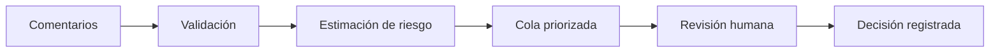

# Moderación asistida de comentarios de YouTube

### La máquina prioriza; la persona decide

[](https://www.python.org/)
[](https://fastapi.tiangolo.com/)
[](https://react.dev/)
[](https://www.docker.com/)
[](#estado-del-proyecto)

## ¿Qué es este proyecto?

Es una aplicación que ayuda a revisar muchos comentarios de YouTube de forma más ordenada.

La aplicación calcula una **puntuación de riesgo** para cada comentario y los coloca en una cola de revisión. Así, la persona moderadora puede empezar por los comentarios que parecen necesitar más atención.

La puntuación es solo una ayuda. **La decisión final siempre la toma una persona.**

## ¿Para quién está pensado?

Está pensado para personas que moderan comentarios de YouTube, especialmente cuando tienen que revisar muchos comentarios en inglés.

La persona moderadora puede:

- Ver una cola de comentarios ordenada por riesgo estimado.
- Consultar el texto completo y el contexto autorizado.
- Revisar cada comentario manualmente.
- Registrar qué decisión tomó y dejar un registro trazable.

## ¿Qué hace?

- Recibe un lote de comentarios.
- Comprueba que los datos sean válidos.
- Estima una señal relacionada con la toxicidad.
- Ordena los comentarios de mayor a menor riesgo estimado.
- Permite consultar el detalle de un comentario autorizado.
- Permite registrar una revisión humana.

Cuando dos comentarios tienen la misma puntuación, se conserva el orden en el que fueron recibidos.

## ¿Qué no hace?

Este MVP:

- No se conecta directamente a YouTube.
- No publica, oculta, elimina ni responde comentarios.
- No aplica sanciones.
- No decide automáticamente si un comentario incumple una norma.
- No sustituye a la persona moderadora.
- No puede entender por sí solo toda la ironía, la intención o el contexto que falta.

## ¿Cómo funciona?



En resumen:

1. Se importa un lote de comentarios.
2. La API valida los datos.
3. El modelo estima el riesgo de toxicidad.
4. Los comentarios se ordenan para facilitar la revisión.
5. La persona moderadora revisa cada caso.
6. La decisión humana queda registrada.

## Tecnologías principales

- React, TypeScript y Vite para la interfaz.
- Python y FastAPI para la API.
- SQLite para la persistencia local.
- Regresión logística y TF-IDF para estimar el riesgo.
- Docker Compose para ejecutar el proyecto.
- Swagger / OpenAPI para consultar y probar la API.
- Nginx para servir el frontend dentro de Docker.

## Datos y modelo

El proyecto utiliza un dataset de 1.000 comentarios en inglés. Cada registro incluye, entre otros datos:

- `CommentId`: identificador del comentario.
- `VideoId`: identificador del vídeo.
- `Text`: texto del comentario.
- `IsToxic`: etiqueta inicial usada para entrenar el modelo.

El dataset contiene 462 comentarios etiquetados como tóxicos y 538 como no tóxicos. Los comentarios del mismo vídeo se mantienen juntos al dividir los datos para reducir el riesgo de fuga de información.

El modelo productivo es:

```text
Texto → TF-IDF de caracteres → Regresión logística → Probabilidad de toxicidad
```

Esta probabilidad sirve para ordenar la cola, no para tomar una decisión de moderación.

Si el modelo no está disponible, la API puede usar un `SimulatedScorer` para demos locales. En ese caso, las puntuaciones son simuladas y no representan predicciones reales.

El dataset puede no representar todos los idiomas, dialectos, comunidades, temas o contextos. Sus etiquetas también pueden contener sesgos o desacuerdos. Por eso, la puntuación debe interpretarse únicamente como una señal de priorización.

El archivo original se mantiene fuera del repositorio mientras se confirman sus condiciones de licencia y redistribución.

## Ejecutar con Docker

### Requisitos

- Docker Desktop.
- Docker Compose v2.
- Git.

Desde la raíz del repositorio:

```bash
docker compose up --build
```

Después, abre:

- Aplicación: <http://localhost:5173>
- API: <http://localhost:8000>
- Documentación Swagger: <http://localhost:8000/docs>
- Comprobación de estado: <http://localhost:8000/health>

Para detener los servicios:

```bash
docker compose down
```

La base de datos SQLite se conserva en el volumen Docker `moderation-data`.

## Probar la demo

La demo usa comentarios sintéticos. No descarga ni publica contenido en YouTube.

Primero, crea los usuarios locales:

```bash
docker compose exec backend python -m app.seed_demo_users
```

El comando solicita las contraseñas de forma interactiva y no las guarda en el repositorio.

Después:

1. Abre <http://localhost:8000/docs>.
2. Ejecuta `POST /auth/login`.
3. Copia el `access_token`.
4. Pulsa **Authorize** y escribe `Bearer <access_token>`.
5. Ejecuta `POST /comments/import` con datos de prueba.

Ejemplo:

```json
{
  "items": [
    {
      "comment_id": "demo-001",
      "video_id": "video-001",
      "text": "This is a synthetic comment for the moderation demo."
    },
    {
      "comment_id": "demo-002",
      "video_id": "video-001",
      "text": "This comment contains an insulting phrase for review."
    }
  ]
}
```

6. Abre <http://localhost:5173>.
7. Inicia sesión.
8. Selecciona un comentario.
9. Consulta el detalle.
10. Registra una revisión humana.

## API principal

| Método | Endpoint | Descripción |
|---|---|---|
| `GET` | `/health` | Comprueba si la API está disponible. |
| `POST` | `/auth/login` | Inicia una sesión. |
| `POST` | `/auth/logout` | Cierra una sesión. |
| `GET` | `/comments` | Consulta la cola priorizada. |
| `GET` | `/comments/{id}` | Consulta el detalle autorizado. |
| `POST` | `/comments/import` | Importa un lote de comentarios. |
| `POST` | `/comments/{id}/review` | Registra una revisión humana. |

## Desarrollo local

### Backend

```bash
python -m venv .venv
```

En Linux/macOS:

```bash
source .venv/bin/activate
pip install -e ".[dev]"
python -m app.seed_demo_users
uvicorn app.main:create_app --factory --reload --host 127.0.0.1 --port 8000
```

En Windows PowerShell:

```powershell
.\.venv\Scripts\Activate.ps1
pip install -e ".[dev]"
python -m app.seed_demo_users
python -m uvicorn app.main:create_app --factory --reload --host 127.0.0.1 --port 8000
```

### Frontend

```bash
cd frontend
npm install
```

Crea `frontend/.env` con:

```env
VITE_API_URL=http://127.0.0.1:8000
```

Arranca el frontend:

```bash
npm run dev
```

Para validar el frontend:

```bash
npm run build
npm run lint
```

## Privacidad y seguridad

- Los tokens permanecen en memoria en el frontend.
- Las contraseñas no se guardan en Git.
- La cola no devuelve el texto completo de los comentarios.
- El texto completo solo aparece en el detalle autorizado.
- Los archivos `.env`, las bases SQLite, los modelos y los datos locales están excluidos del repositorio.
- No se ejecutan acciones externas automáticas sobre los comentarios.

## Estado del proyecto

El proyecto está en fase **MVP**. Ya incluye la API, autenticación, importación de comentarios, cola priorizada, modelo inicial, frontend React, revisiones humanas, persistencia SQLite, Docker Compose y documentación Swagger.

Queda pendiente:

- Validar la solución con personas moderadoras.
- Medir la experiencia de uso.
- Revisar manualmente accesibilidad y seguridad.
- Validar el modelo con datos más representativos.
- Confirmar la licencia y autoría original del dataset.
- Preparar un despliegue en producción.
