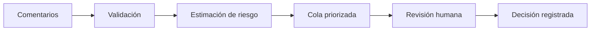

# Moderación asistida de comentarios

[](https://www.python.org/)
[](https://fastapi.tiangolo.com/)
[](https://react.dev/)
[](https://www.docker.com/)
[](#estado-del-proyecto)

## ¿Qué es este proyecto?

## Qué es

Es una aplicación de moderación asistida para organizar comentarios y ayudar a una persona moderadora a decidir cuáles revisar primero. Calcula una puntuación de riesgo orientativa, muestra una cola priorizada y permite consultar el texto completo solo a usuarios autenticados y autorizados.

Está pensada para equipos de moderación que necesitan revisar muchos comentarios de forma ordenada y trazable. El MVP trabaja con comentarios en inglés y utiliza `IsToxic` como referencia de alcance; esta etiqueta no cubre por sí sola gravedad, violencia, discurso de odio ni todas las políticas de una plataforma.

## Qué problema resuelve

Revisar comentarios solo por orden de llegada puede retrasar los casos que necesitan atención. El sistema usa una señal estimada para ordenar la cola y ayudar a la persona moderadora a priorizar su trabajo.

## Qué hace y qué no hace

Hace lo siguiente:

- Importa y valida lotes de comentarios.
- Calcula riesgo e incertidumbre y ordena una cola pendiente.
- Oculta el texto completo en la cola y lo muestra solo en el detalle autorizado.
- Permite registrar `NEEDS_REVIEW`, `CONFIRMED_TOXIC` o `NOT_TOXIC`, con notas opcionales.
- Guarda usuario, fecha, estado y decisión de la revisión.
- Aplica autenticación y roles `MODERATOR` y `SUPERVISOR`.

No elimina, bloquea, denuncia ni sanciona comentarios; no se conecta a YouTube; no funciona en tiempo real; no clasifica sentimientos ni interpreta automáticamente políticas externas. La puntuación no es una decisión automática ni una certeza: solo sirve para priorizar y la decisión final siempre la toma una persona moderadora.

## Cómo funciona



En resumen:

1. Se importa un lote de comentarios.
2. La API valida los datos.
3. El modelo estima el riesgo de toxicidad.
4. Los comentarios se ordenan para facilitar la revisión.
5. La persona moderadora revisa cada caso.
6. La decisión humana queda registrada.

## Tecnologías principales

- React, TypeScript y Vite para la interfaz.
- Python y FastAPI para la API.
- SQLite para la persistencia local.
- Regresión logística y TF-IDF para estimar el riesgo.
- Docker Compose para ejecutar el proyecto.
- Swagger / OpenAPI para consultar y probar la API.
- Nginx para servir el frontend dentro de Docker.

## Datos y modelo

El proyecto utiliza un dataset de 1.000 comentarios en inglés. Cada registro incluye, entre otros datos:

- `CommentId`: identificador del comentario.
- `VideoId`: identificador del vídeo.
- `Text`: texto del comentario.
- `IsToxic`: etiqueta inicial usada para entrenar el modelo.

El dataset contiene 462 comentarios etiquetados como tóxicos y 538 como no tóxicos. Los comentarios del mismo vídeo se mantienen juntos al dividir los datos para reducir el riesgo de fuga de información.

El modelo productivo es:

```text
Texto → TF-IDF de caracteres → Regresión logística → Probabilidad de toxicidad
```

Esta probabilidad sirve para ordenar la cola, no para tomar una decisión de moderación.

Si el modelo no está disponible, la API puede usar un `SimulatedScorer` para demos locales. En ese caso, las puntuaciones son simuladas y no representan predicciones reales.

El dataset puede no representar todos los idiomas, dialectos, comunidades, temas o contextos. Sus etiquetas también pueden contener sesgos o desacuerdos. Por eso, la puntuación debe interpretarse únicamente como una señal de priorización.

El archivo original se mantiene fuera del repositorio mientras se confirman sus condiciones de licencia y redistribución.

## Ejecutar con Docker

### Requisitos

- Docker Desktop.
- Docker Compose v2.
- Git.

Desde la raíz del repositorio:

```bash
docker compose up --build
```

Después, abre:

- Aplicación: <http://localhost:5173>
- API: <http://localhost:8000>
- Documentación Swagger: <http://localhost:8000/docs>
- Comprobación de estado: <http://localhost:8000/health>

Para detener los servicios:

```bash
docker compose down
```

La base de datos SQLite se conserva en el volumen Docker `moderation-data`.

## Probar la demo

La demo usa comentarios sintéticos. No descarga ni publica contenido en YouTube.

Primero, crea los usuarios locales:

```bash
docker compose exec backend python -m app.seed_demo_users
```

El comando solicita las contraseñas de forma interactiva y no las guarda en el repositorio.

Después:

1. Abre <http://localhost:8000/docs>.
2. Ejecuta `POST /auth/login`.
3. Copia el `access_token`.
4. Pulsa **Authorize** y escribe `Bearer <access_token>`.
5. Ejecuta `POST /comments/import` con datos de prueba.

Ejemplo:

```json
{
  "items": [
    {
      "comment_id": "demo-001",
      "video_id": "video-001",
      "text": "This is a synthetic comment for the moderation demo."
    },
    {
      "comment_id": "demo-002",
      "video_id": "video-001",
      "text": "This comment contains an insulting phrase for review."
    }
  ]
}
```

6. Abre <http://localhost:5173>.
7. Inicia sesión.
8. Selecciona un comentario.
9. Consulta el detalle.
10. Registra una revisión humana.

## API principal

| Método | Endpoint | Descripción |
|---|---|---|
| `GET` | `/health` | Comprueba si la API está disponible. |
| `POST` | `/auth/login` | Inicia una sesión. |
| `POST` | `/auth/logout` | Cierra una sesión. |
| `GET` | `/comments` | Consulta la cola priorizada. |
| `GET` | `/comments/{id}` | Consulta el detalle autorizado. |
| `POST` | `/comments/import` | Importa un lote de comentarios. |
| `POST` | `/comments/{id}/review` | Registra una revisión humana. |

## Desarrollo local

### Backend

```bash
python -m venv .venv
```

## Estructura y documentación

```text
backend/app/                 API FastAPI, autenticación, comentarios y base de datos
backend/tests/               Tests de la API y revisiones
frontend/src/                Aplicación React/Vite
src/moderation/              Modelos y evaluación
scripts/                     Entrenamiento y comparación
docs/backend/                Documentación de API y demo
docs/model/                  Documentación de modelos y métricas
data/splits/                 Split común versionado
configs/                     Configuraciones de evaluación
```

- [Visión de producto](docs/product-vision.md)
- [Discovery](docs/product/DISCOVERY.md)
- [Primer endpoint](docs/backend/01-primer-endpoint.md)
- [Persistencia](docs/backend/02-base-de-datos.md)
- [Autenticación y permisos](docs/backend/03-autenticacion-y-permisos.md)
- [Carga y cola priorizada](docs/backend/04-carga-y-cola-priorizada.md)
- [Logistic + TF-IDF](docs/model/logistic-tfidf.md)
- [Ensemble](docs/model/ensemble.md)
- [Transformer](docs/model/transformer.md)

### Frontend

Proyecto desarrollado por **Fernanda**, **Gabriela** y **Arnaldo** durante el bootcamp de Inteligencia Artificial de Factoría F5.
