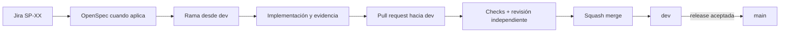

<div align="center">

# Moderación asistida de comentarios

### NLP clásico para priorizar la revisión humana de contenido potencialmente tóxico

[](https://github.com/Bootcamp-IA-MAD-P7/proyecto9-grupo3/actions/workflows/harness.yml)


Una herramienta de apoyo para que una persona moderadora identifique antes los
comentarios que requieren atención, sin delegar la decisión final en el modelo.

</div>

---

## Estado del proyecto

| Área | Estado | Evidencia actual |
| --- | :---: | --- |
| Problema, persona y alcance del MVP | ✅ | [Visión de producto](docs/product-vision.md) |
| Flujo Jira, Git y pull requests | ✅ | [Guía de contribución](CONTRIBUTING.md) |
| SDD, OpenSpec y project harness | ✅ | [Project harness](docs/HARNESS.md) |
| Controles de calidad y seguridad | ✅ | Harness automático y protección de ramas |
| Base del backend | ✅ | API local con `/health`, documentación y pruebas; [guía del paso 1](docs/backend/01-primer-endpoint.md) |
| Persistencia del backend | ✅ | SQLite guarda usuarios y comentarios; [guía del paso 2](docs/backend/02-base-de-datos.md) |
| Autenticación y permisos | ✅ | Login, sesiones SQLite, hashes Argon2id y guard de roles; [guía del paso 3](docs/backend/03-autenticacion-y-permisos.md) |
| Línea base del modelo | ⏳ | Pendiente de entrenamiento y evaluación reproducible |
| Vertical funcional y demo | ⏳ | Pendiente de implementación |
| Arquitectura y despliegue AWS | ⏳ | Se decidirán con las necesidades del vertical |

> **Estado verificable:** la API local, la persistencia SQLite y el login están
> operativos. La cola de revisión, el modelo evaluado y el despliegue todavía no
> están implementados.

## Ejecutar la primera API

Desde la raíz del repositorio, con Python 3.12 o superior:

```powershell
python -m venv .venv
.\.venv\Scripts\python.exe -m pip install -c backend/constraints.txt -e '.[dev]'
.\.venv\Scripts\python.exe -m uvicorn app.main:create_app --factory --reload --host 127.0.0.1 --port 8000
```

Abre [la documentación local](http://127.0.0.1:8000/docs) y prueba `GET /health`.
La [guía del primer endpoint](docs/backend/01-primer-endpoint.md) explica cada
archivo, cómo ejecutar las pruebas y qué construiremos en las siguientes entregas.

La [guía de persistencia](docs/backend/02-base-de-datos.md) explica las tablas,
las transacciones y cómo inspeccionarlas con datos sintéticos. La base local se
guarda en `data/local/moderation.db` y queda fuera de Git.

Para probar autenticación, carga los usuarios `moderator` y `supervisor` con
contraseñas elegidas por ti:

```powershell
.\.venv\Scripts\python.exe -m app.seed_demo_users
```

La [guía de autenticación y permisos](docs/backend/03-autenticacion-y-permisos.md)
recorre login, autorización en Swagger y logout.

## El problema

Revisar comentarios en orden de llegada puede hacer que contenido potencialmente
dañino espere mientras se atienden casos de menor riesgo. El proyecto explora si
una cola priorizada permite decidir antes qué comentario revisar.

## La propuesta

El MVP procesará comentarios en inglés y estimará el **riesgo de toxicidad** para
el objetivo inicial `IsToxic`. La señal servirá para ordenar la revisión; no será
un veredicto, una medida de gravedad ni una interpretación de las políticas de
YouTube.

| El sistema ayuda a… | El sistema no… |
| --- | --- |
| Priorizar comentarios por riesgo estimado | Elimina, bloquea, denuncia o sanciona |
| Revisar manualmente texto en inglés | Se conecta a YouTube ni opera en tiempo real |
| Mantener un orden estable en los empates | Clasifica sentimiento o español |
| Mostrar resultados y errores comprensibles | Presenta probabilidades como certezas |
| Conservar la decisión humana final | Sustituye el criterio de moderación |

## Recorrido previsto del MVP

```mermaid
flowchart LR
    A[Comentario en inglés] --> B[Validación de entrada]
    B --> C[Pipeline NLP versionado]
    C --> D[Riesgo estimado de IsToxic]
    D --> E[Cola priorizada]
    E --> F[Revisión humana]
    F --> G[Decisión final fuera del modelo]

    classDef input fill:#f6f8fa,stroke:#57606a,color:#24292f;
    classDef system fill:#ddf4ff,stroke:#0969da,color:#0550ae;
    classDef human fill:#dafbe1,stroke:#1a7f37,color:#116329;
    class A input;
    class B,C,D,E system;
    class F,G human;
```



El pipeline técnico previsto utilizará técnicas clásicas y reproducibles:

```text
Dataset → validación → split reproducible → preprocesamiento → TF-IDF
        → clasificador → evaluación → artefacto versionado → inferencia
```

Las métricas se publicarán únicamente cuando hayan sido generadas por el pipeline
de evaluación: `precision`, `recall`, `F1`, matriz de confusión, resultados de
train/test y comprobación de posible fuga mediante `VideoId`.

## Cómo trabajamos

El proyecto aplica Specification-Driven Development con una cadena de trazabilidad
ligera. Cada capa tiene una responsabilidad concreta:

| Capa | Responsabilidad |
| --- | --- |
| Jira | Prioridad, responsable, estado y criterios de aceptación |
| OpenSpec | Comportamiento verificable, diseño técnico y tareas |
| Git y PR | Implementación, revisión, pruebas y evidencias |
| Harness | Reglas automáticas que evitan desviaciones del proceso |
| AWS | Evidencia futura de ejecución, no sustituto de la especificación |



### Controles aplicados

- Ramas `feature/`, `fix/`, `docs/`, `test/`, `ci/` o `chore/` con clave Jira.
- Conventional Commits y títulos de PR normalizados en inglés.
- Plantilla de PR con Jira, OpenSpec, criterios, pruebas, evidencias y rollback.
- Revisión independiente y check `validate` obligatorios antes del merge.
- `dev` como rama de integración; `main` reservada para releases aceptadas.
- Squash merge, historial lineal y bloqueo del push directo.
- Exclusión de credenciales, `.env`, claves y rutas locales de datos sensibles.
- Tags y releases diferidos hasta que exista el primer vertical funcional.

## Validación local

El repositorio no necesita dependencias adicionales para comprobar su estructura:

```powershell
python -m unittest tests.test_validate_harness
python scripts/validate_harness.py
git diff --check
```

## Estructura actual

```text
.
├── .agents/                  # Skills reutilizables para agentes
├── .github/                  # CODEOWNERS, PR template y workflow
├── backend/                  # API FastAPI, pruebas y dependencias verificadas
├── docs/                     # Visión, discovery, harness y estándares
├── openspec/changes/         # Propuestas, diseño, specs y tareas verificables
├── scripts/                  # Validadores ligeros del repositorio
├── tests/                    # Pruebas automáticas del harness
├── AGENTS.md                 # Punto de entrada para agentes
├── CONTRIBUTING.md           # Guía breve de contribución
├── pyproject.toml            # Paquete Python y configuración de pruebas
└── README.md                 # Visión general y estado verificable
```

La API, la base de datos y la autenticación están implementadas. La cola,
el modelo evaluado y la infraestructura se añadirán en entregas posteriores.

## Documentación

| Documento | Propósito |
| --- | --- |
| [Visión de producto](docs/product-vision.md) | Problema, persona, alcance, métricas y límites del MVP |
| [Project charter](docs/product/PROJECT_CHARTER.md) | Encargo, contexto y criterio de éxito |
| [Discovery](docs/product/DISCOVERY.md) | Evidencia e hipótesis de producto |
| [Estándares base](docs/base-standards.md) | Fuente única de verdad para las normas del equipo |
| [Project harness](docs/HARNESS.md) | Ciclo SDD, controles y puertas humanas |
| [Guía de contribución](CONTRIBUTING.md) | Entrada breve al flujo de trabajo |
| [OpenSpec](openspec/changes/) | Contratos versionados y escenarios verificables |

## Próximos hitos

1. Auditar el dataset y construir una línea base reproducible para `IsToxic`.
2. Definir los contratos entre modelo, API e interfaz.
3. Implementar y verificar un vertical completo de comentario a predicción.
4. Validar la experiencia, desplegar una demo autorizada y preparar evidencias.
5. Promover la primera versión aceptada de `dev` a `main` y publicar su release.

## Equipo

Proyecto desarrollado por **Gabriela Granja**, **Fernanda Trk** y
**Miguel Redondo** durante el bootcamp de Inteligencia Artificial de
Factoría F5.

Las decisiones se registran en Jira, se especifican en OpenSpec cuando son
materiales y se demuestran mediante código, pruebas y revisiones en GitHub.
