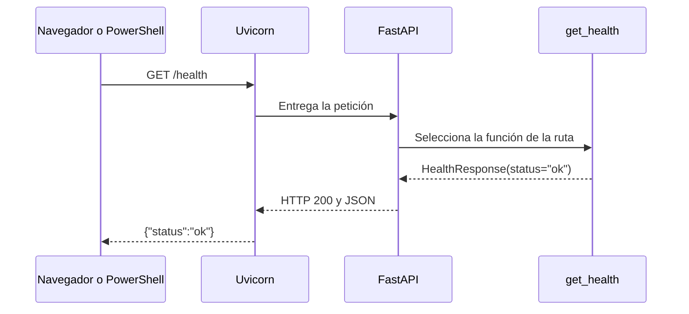

# Paso 1: entender y ejecutar nuestra primera API

## Lo que tenemos al terminar este paso

Una aplicación Python que responde a `GET /health` y publica documentación de
su contrato. Es la base del backend: todavía no guarda comentarios, autentica
usuarios ni calcula toxicidad. Esas funciones se construirán en las siguientes
entregas, manteniendo el contexto del proyecto y `back1.txt`.

En esta sesión el usuario ha indicado continuar sin exigir una historia Jira.
La excepción está recogida en el cambio OpenSpec `backend-foundation`.

## Qué hace el backend

El frontend presenta la interfaz. El backend recibe peticiones, comprueba qué
puede hacer cada persona, aplica las reglas y accede a los datos. Por ejemplo,
cuando añadamos reservas, el backend será responsable de impedir que dos
moderadores reserven el mismo comentario, aunque ambos pulsen a la vez.

Empezamos con una operación sin reglas de negocio: comprobar que la API responde.



Un **endpoint** es una combinación de método HTTP y ruta. Aquí `GET` significa
consultar y `/health` identifica la comprobación. El **200** es el código HTTP
de éxito. **JSON** es el formato de datos de la respuesta.

Que `/health` responda demuestra que el proceso atiende peticiones. Cuando haya
base de datos y modelo, comprobar que están disponibles será otra responsabilidad
llamada readiness: estar preparado para atender operaciones de negocio.

## Las piezas y su responsabilidad

| Pieza | Papel en este paso |
| --- | --- |
| Python | Lenguaje en el que escribimos la aplicación |
| Uvicorn | Servidor que escucha peticiones HTTP y las entrega a FastAPI |
| FastAPI | Relaciona métodos y rutas con funciones y construye las respuestas |
| Pydantic | Define y valida la estructura de los datos |
| Pydantic Settings | Lee y valida configuración del entorno y de `.env` |
| OpenAPI | Describe endpoints, parámetros y respuestas en un contrato JSON |
| Swagger UI | Presenta ese contrato como documentación interactiva en `/docs` |
| pytest y HTTPX | Permiten comprobar el comportamiento de la API automáticamente |

OpenAPI y OpenSpec tienen propósitos distintos. OpenAPI describe la interfaz
HTTP. OpenSpec guarda los requisitos, decisiones y tareas del cambio.

```text
backend/
  app/
    __init__.py       identifica el paquete Python
    main.py           ensambla la aplicación
    config.py         lee y valida configuración
    health.py         define GET /health y su respuesta
  tests/
    test_foundation.py
  constraints.txt    versiones de dependencias probadas
pyproject.toml       paquete, dependencias y configuración de pruebas
.env.example        ejemplo público sin secretos
```

La idea futura es un **monolito modular**: una aplicación que organizamos por
responsabilidades. Añadiremos servicios para reglas de moderación y repositorios
para consultas de base de datos cuando implementemos esos comportamientos.

## Leer el código en orden

1. Abre `backend/app/main.py`. `create_app()` es una **factoría**: una función que
   crea y devuelve una aplicación. Primero carga la configuración, luego crea
   FastAPI y finalmente registra el router de salud.
2. Abre `backend/app/health.py`. Un **router** agrupa rutas. El decorador
   `@router.get("/health", ...)` vincula una petición GET con `get_health()`.
3. Observa `HealthResponse`. Su campo `status` solo admite el texto `ok`.
   FastAPI utiliza ese modelo para validar la respuesta y documentarla.
4. Abre `backend/app/config.py`. `Settings` define el nombre de la API y si la
   documentación está habilitada. Se crea dentro de la factoría, de modo que
   cada aplicación carga su propia configuración.

## Preparar el entorno

En esta carpeta ya se ha creado `.venv` y se han instalado las dependencias.
Para repetir la instalación desde cero, abre PowerShell en la raíz del proyecto:

```powershell
Set-Location C:\proyectosF5\proyecto9-grupo3
python -m venv .venv
.\.venv\Scripts\python.exe -m pip install -c backend/constraints.txt -e '.[dev]'
```

`.venv` mantiene las librerías de este proyecto separadas de otros proyectos.
`-e` instala el código en modo editable: los cambios en sus archivos se utilizan
sin reinstalar el paquete. `[dev]` añade las herramientas de pruebas.
`constraints.txt` fija las versiones con las que se comprobó esta entrega;
no es un lock completo del entorno ni fija el intérprete o las herramientas de build.

Usamos directamente el ejecutable de `.venv`, por lo que no necesitas activar
el entorno ni cambiar la política de ejecución de PowerShell.

## Arrancar y probar

Desde la raíz:

```powershell
.\.venv\Scripts\python.exe -m uvicorn app.main:create_app --factory --reload --host 127.0.0.1 --port 8000
```

- `app.main:create_app`: el módulo y la función que construyen la aplicación.
- `--factory`: indica a Uvicorn que debe llamar a esa función.
- `--reload`: reinicia al cambiar archivos Python durante el desarrollo.
- `127.0.0.1`: la API escucha solo en este equipo.
- `8000`: puerto donde espera peticiones.

La terminal debe permanecer abierta. Para detener el servidor, pulsa `Ctrl+C`.
Si el puerto 8000 ya está ocupado, usa `--port 8001` y cambia las URLs.

En otra terminal:

```powershell
Invoke-RestMethod http://127.0.0.1:8000/health
```

PowerShell muestra un objeto con `status` igual a `ok`. Para ver el JSON sin
convertirlo a un objeto de PowerShell:

```powershell
(Invoke-WebRequest http://127.0.0.1:8000/health).Content
```

Respuesta:

```json
{"status":"ok"}
```

Abre [la documentación](http://127.0.0.1:8000/docs), despliega `GET /health`, pulsa
**Try it out** y luego **Execute**. Observa la URL, el código 200 y el cuerpo JSON.
El contrato también está en [OpenAPI](http://127.0.0.1:8000/openapi.json).
La página de Swagger carga recursos del navegador desde una CDN; si no tienes
internet, el JSON de OpenAPI y `/health` siguen siendo consultables localmente.

## Ejercicio: cambiar configuración sin editar Python

Detén el servidor. En la misma terminal, ejecuta:

```powershell
$env:MODERATION_APP_NAME='Mi API de aprendizaje'
.\.venv\Scripts\python.exe -m uvicorn app.main:create_app --factory --reload --host 127.0.0.1 --port 8000
```

Vuelve a `/docs`: el título debe cambiar. Esa variable solo afecta a esa
terminal y sus procesos. Al terminar, detén el servidor y elimina la variable:

```powershell
Remove-Item Env:MODERATION_APP_NAME
```

También puedes crear un `.env` en la raíz tomando como referencia `.env.example`.
Las variables de la terminal tienen prioridad sobre ese archivo. `.env` está
excluido de Git. Reinicia el servidor después de cambiar su configuración.

`MODERATION_DOCS_ENABLED=false` desactiva `/docs`, `/redoc` y `/openapi.json`;
`/health` permanece disponible. Un valor como `not-a-boolean` detiene el arranque
con un error de validación, para que la configuración incorrecta sea visible.

## Comprobar automáticamente

```powershell
.\.venv\Scripts\python.exe -m pytest -q
```

Las pruebas comprueban salud, contrato OpenAPI, documentación configurable,
lectura de `.env`, prioridad de las variables e invalidación de configuración.
El cliente de pruebas llama a la aplicación sin abrir un puerto real.
Además, esta entrega se ha comprobado arrancando Uvicorn y haciendo peticiones HTTP.

En una terminal con restricciones sobre la carpeta temporal de Windows:

```powershell
.\.venv\Scripts\python.exe -m pytest -q --basetemp=.pytest_cache/foundation-temp
```

Ese argumento reserva una carpeta desechable para pytest; pytest puede vaciarla.
No lo apuntes a una carpeta con archivos de trabajo.

## Nuestro recorrido de aprendizaje

| Paso | Resultado que construiremos | Concepto principal |
| --- | --- | --- |
| 1, esta entrega | API ejecutable y documentación | Petición, respuesta, configuración y pruebas |
| 2 | Usuarios y comentarios persistentes con datos sintéticos | Tablas, claves, relaciones, transacciones y migraciones |
| 3 | Login y permisos de moderador/supervisor | Autenticación, autorización y hash de contraseñas |
| 4 | Carga de comentarios y cola priorizada | Validación, predicción desacoplada, paginación y orden estable |
| 5 | Reserva, revelación y decisión con histórico | Concurrencia, estados, permisos y auditoría |
| 6 | Escalados y reaperturas | Transiciones autorizadas y conservación de decisiones |
| 7 | Conexión con frontend y modelo real | Contratos compartidos, errores y pruebas de integración |

Cada entrega concretará su contrato antes de escribir su código. Para el paso 6
resolveremos la diferencia entre deshacer revisiones en SP-2 y exigir aprobación
del supervisor en `back1.txt`. En los pasos 4 y 5 definiremos también qué ocurre
ante contexto insuficiente, transferencias o reservas abandonadas.

Los datos del documento son requisitos propuestos: esta guía no afirma que el
CSV local se haya auditado. Usaremos ejemplos sintéticos hasta disponer de los
datos autorizados. El modelo simulado se identificará como tal y ningún endpoint
ejecutará moderación sobre YouTube.

## Referencias

- [Primeros pasos con FastAPI](https://fastapi.tiangolo.com/tutorial/first-steps/)
- [Configuración y variables de entorno](https://fastapi.tiangolo.com/advanced/settings/)
- [Pruebas con FastAPI](https://fastapi.tiangolo.com/tutorial/testing/)
- [Diseño de esta entrega](../../openspec/changes/backend-foundation/design.md)
- [Escenarios verificables](../../openspec/changes/backend-foundation/specs/backend-foundation/spec.md)
