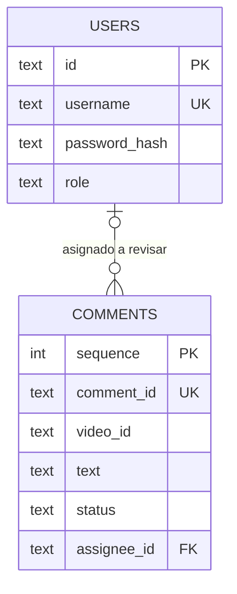

# Paso 2: persistencia con SQLite

## Qué añadimos

El paso 1 respondía peticiones HTTP, pero no conservaba datos. Ahora el servidor
abre una base SQLite local y crea dos tablas: `users` para las personas que usarán
el portal y `comments` para los comentarios que más adelante se revisarán. La
base está en `data/local/moderation.db` y Git ignora esa carpeta.

Esta integración usa **SQLite directo** en los cuatro pasos. La versión aislada
de este paso exploró SQLAlchemy y Alembic en otra copia de trabajo; sus esquemas
no eran compatibles con la autenticación y la cola construidas después. La
decisión de unificar en SQLite directo evita dos modelos de datos rivales. No se
ha borrado la otra copia.

## Tablas y relación



`assignee_id` es la persona moderadora asignada, **no** la autora del comentario.
Puede ser nulo hasta que exista el flujo de reserva. `sequence` conserva el orden
de entrada para desempatar en la futura cola. `comment_id` y `video_id` conservan
los identificadores del origen. `password_hash` está reservado para hashes: el
paso 3 implementa login y crea usuarios de demo con Argon2id.

Una **clave primaria** identifica una fila. Una **clave foránea** exige que la
persona asignada exista. `CHECK` limita los roles y estados válidos. `UNIQUE`
impide repetir nombres de usuario e IDs de comentario. Los estados disponibles
en la tabla preparan el flujo futuro, pero este paso no permite cambiarlos por
HTTP.

## Conexión, transacción y versión

`Database.connect()` abre una conexión por operación, activa claves foráneas y
cierra la conexión al terminar. El bloque `with` confirma los cambios si todo
sale bien y revierte el lote si ocurre un error. Las consultas posteriores de
autenticación y cola usarán parámetros SQL, nunca concatenarán entradas de una
persona en una sentencia.

Al arrancar, `Database.initialize()` lee `PRAGMA user_version`. Si el archivo es
nuevo, crea el esquema versión 1 en una transacción. Si ya está en versión 1, no
borra ni recrea datos. Una versión futura desconocida provoca un error explícito.
Los pasos 3 y 4 ampliarán este método con migraciones pequeñas y conservarán las
filas anteriores. Antes de retroceder código contra una base migrada, haz una
copia del archivo local.

## Ejecutar y comprobar

Desde la raíz del repositorio:

```powershell
python -m venv .venv
.\.venv\Scripts\python.exe -m pip install -c backend/constraints.txt -e '.[dev]'
.\.venv\Scripts\python.exe -m uvicorn app.main:create_app --factory --host 127.0.0.1 --port 8000
```

`GET /health` sigue respondiendo `{"status":"ok"}`. No hay todavía una ruta
para leer usuarios o texto. Para comprobar las tablas sin tocar la base local,
ejecuta los tests: crean
archivos temporales, insertan datos sintéticos, provocan fallos y comprueban el
rollback.

```powershell
.\.venv\Scripts\python.exe -m pytest backend/tests/test_database.py -q
```

## Ejercicio de arquitectura

Localiza `create_app()` en `backend/app/main.py`: crea `Database` y llama a
`initialize()` al arrancar. Luego busca `connect()` en
`backend/app/database.py` y sigue la transacción del test de duplicados. Si la
segunda inserción repite el ID, SQLite revierte también la primera; esa es la
propiedad de **atomicidad** que usaremos para cargar lotes en el paso 4.
