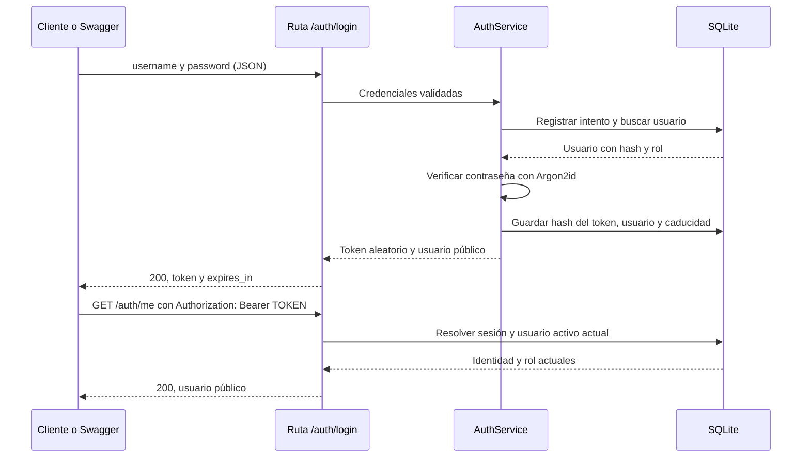

# Paso 3: autenticación y permisos

## Qué construimos

Una persona puede iniciar sesión, consultar su identidad y cerrar esa sesión.
El servidor guarda usuarios con contraseñas protegidas y decide su rol.

El paso 2 ya creó usuarios y comentarios en SQLite. Este paso amplía ese esquema
con sesiones e intentos de login sin borrar las filas existentes.

## Dos preguntas diferentes

**Autenticación: quién eres.** Al iniciar sesión, el servidor verifica tu
contraseña. Si coincide y el usuario está activo, crea una sesión temporal.

**Autorización: qué puedes hacer.** Una sesión válida no da acceso a todo.
El backend comprueba si el rol del usuario permite la operación solicitada.

| Situación | Respuesta |
| --- | --- |
| Contraseña incorrecta, usuario desconocido o inactivo | `401 Unauthorized` |
| Sesión ausente, inválida, caducada o cerrada | `401 Unauthorized` |
| Sesión válida, pero rol insuficiente | `403 Forbidden` |
| Cuerpo de login inválido o con campos adicionales | `422 Unprocessable Entity` |
| Demasiados intentos de login para un usuario | `429 Too Many Requests` y `Retry-After` |

Ocultar un botón en el frontend puede ayudar a la experiencia, pero el permiso
siempre se comprueba de nuevo en el servidor.

## Qué ocurre durante el login



El **token Bearer** es una credencial temporal: quien lo tenga puede utilizar
esa sesión. Dura 30 minutos por defecto y no se renueva automáticamente.
Usamos un token opaco, aleatorio, de 256 bits: no contiene el nombre ni el rol.
SQLite relaciona su hash con un usuario y la fecha de caducidad.

Esta decisión facilita cerrar sesiones inmediatamente y consultar los permisos
actuales en cada petición. JWT es otra alternativa; para esta demo, las sesiones
guardadas en el servidor permiten practicar esos conceptos con menos piezas.

## Hash de contraseña y hash de token

**Contraseñas:** usamos Argon2id, a través de `pwdlib`. Es deliberadamente costoso
para dificultar probar muchas contraseñas robadas. Cada hash tiene una sal
aleatoria: dos usuarios con la misma contraseña tendrán hashes distintos.
Al iniciar sesión se verifica la contraseña contra el hash; no se descifra nada.

**Tokens:** se generan con suficiente aleatoriedad y guardamos su digest SHA-256.
SHA-256 sirve aquí para localizar una credencial aleatoria, pero no sustituye
a Argon2 para almacenar contraseñas humanas. El token original se entrega al
cliente y no se guarda en la tabla de sesiones.

La guía de [FastAPI sobre contraseñas](https://fastapi.tiangolo.com/tutorial/security/oauth2-jwt/)
y las recomendaciones de [OWASP sobre almacenamiento de contraseñas](https://cheatsheetseries.owasp.org/cheatsheets/Password_Storage_Cheat_Sheet.html)
explican estas técnicas.

## Organización del código

| Archivo | Responsabilidad |
| --- | --- |
| `backend/app/database.py` | Abrir conexiones y migrar el esquema SQLite a versión 2 |
| `backend/app/auth/router.py` | Recibir HTTP y devolver códigos y modelos públicos |
| `backend/app/auth/schemas.py` | Definir y validar los datos de la API |
| `backend/app/auth/service.py` | Aplicar reglas de login, caducidad y logout |
| `backend/app/auth/repository.py` | Ejecutar consultas SQL parametrizadas |
| `backend/app/auth/security.py` | Hashes de contraseñas y operaciones sobre tokens |
| `backend/app/auth/dependencies.py` | Resolver la sesión y comprobar roles |
| `backend/app/auth/models.py` | Representar el usuario interno y los dos roles |
| `backend/app/errors.py` | Evitar repetir valores recibidos en errores de validación |
| `backend/app/seed_demo_users.py` | Cargar los dos usuarios de demostración |

Un **servicio** reúne reglas: por ejemplo, un usuario inactivo no puede iniciar
sesión. Un **repositorio** conoce cómo guardar o consultar datos. Las rutas
traducen entre HTTP y esas reglas. Así podremos modificar el almacenamiento
sin reescribir todos los endpoints.

## La base de datos mínima

| Tabla | Qué guarda |
| --- | --- |
| `users` | Identidad, nombre, hash, rol y estado activo (paso 2) |
| `comments` | Identificador, vídeo, texto, estado y asignación (paso 2) |
| `sessions` | Hash del token, usuario, creación y caducidad |
| `login_attempts` | Contador y comienzo de la ventana por nombre de usuario |

`users.id` es una clave primaria. `sessions.user_id` es una clave foránea que
apunta a un usuario existente. SQLite rechaza roles diferentes de `MODERATOR`
y `SUPERVISOR`, además de sesiones huérfanas.

Al arrancar, una base de versión 1 se migra a versión 2 añadiendo las tablas de
sesiones e intentos; usuarios y comentarios se conservan. Volver a arrancar no
recrea datos. `PRAGMA user_version` registra la versión y una versión futura
desconocida se rechaza. Es una secuencia pequeña de migraciones SQLite.

## Preparar esta copia de trabajo

Ejecuta desde la raíz de la copia donde está este archivo:

```powershell
python -m venv .venv
.\.venv\Scripts\python.exe -m pip install -c backend/constraints.txt -e '.[dev]'
```

Si ya existe este entorno y sus dependencias están instaladas, continúa con la
carga de usuarios. Cada copia de trabajo tiene su propio entorno y su propia
base de datos local por defecto.

## Cargar los usuarios de demostración

```powershell
.\.venv\Scripts\python.exe -m app.seed_demo_users
```

El comando pide, sin mostrarlas al escribir, una contraseña para `moderator` y
otra para `supervisor`. Elige contraseñas de entre 12 y 1024 caracteres y guárdalas
para la prueba. Estos son los nombres y roles creados:

| Username | Rol |
| --- | --- |
| `moderator` | `MODERATOR` |
| `supervisor` | `SUPERVISOR` |

No hay contraseñas predeterminadas. Repetir el comando conserva las cuentas y
contraseñas existentes; no sirve para cambiarlas. Para automatizar pruebas locales,
el comando también admite `MODERATION_DEMO_MODERATOR_PASSWORD` y
`MODERATION_DEMO_SUPERVISOR_PASSWORD` en el entorno del proceso. No las incluyas
en el repositorio ni en argumentos de la línea de comandos.

La ruta predeterminada es `data/local/moderation.db`, ignorada por Git. El comando
y el servidor deben usar el mismo `MODERATION_DATABASE_PATH` y directorio de trabajo.

## Ejercicio 1: recorrer una sesión completa en Swagger

Arranca la API:

```powershell
.\.venv\Scripts\python.exe -m uvicorn app.main:create_app --factory --reload --host 127.0.0.1 --port 8000
```

1. Abre [Swagger](http://127.0.0.1:8000/docs).
2. Ejecuta `GET /auth/me` sin autorizarte. Debes recibir `401`.
3. Abre `POST /auth/login` y pulsa **Try it out**. Envía `username` igual a
   `moderator` y `password` igual a la contraseña que elegiste al cargar la demo.
4. Observa la respuesta `200`: contiene `access_token`, `token_type`, `expires_in`
   y los datos públicos de `user`, cuyo rol será `MODERATOR`.
5. Copia únicamente el valor de `access_token`. Pulsa **Authorize**, pégalo en
   el campo Bearer y confirma. Swagger añadirá `Authorization: Bearer ...`.
6. Ejecuta `GET /auth/me`. Ahora debe responder `200` con tu identidad y rol.
7. Ejecuta `POST /auth/logout`. Debe responder `204`, sin cuerpo.
8. Sin cambiar el token de Swagger, ejecuta otra vez `GET /auth/me`: debe dar `401`.

El botón **Logout** del cuadro Authorize de Swagger solo borra el token de ese
cliente. Nuestro endpoint `/auth/logout` es el que revoca la sesión en el servidor.

## Ejercicio 2: entender los roles

Repite el login con `supervisor`: el rol cambia porque está guardado en SQLite.
Si añades `"role": "SUPERVISOR"` al JSON de login, la petición se rechaza con
`422`. Una cabecera inventada `X-Role: SUPERVISOR` tampoco concede permisos.

Todavía no están implementadas las operaciones de supervisión del paso 6.
La comprobación reutilizable de roles ya está lista. Las pruebas montan una ruta
temporal `/test/supervisor` para demostrar `401`, `403` y `200`; esa ruta solo
existe dentro de la suite de pruebas.

```powershell
.\.venv\Scripts\python.exe -m pytest backend/tests/test_auth.py -k role_guard -v
```

En una futura ruta de supervisor añadiremos como dependencia:

```python
Depends(require_roles(Role.SUPERVISOR))
```

FastAPI ejecutará primero esa comprobación. Cada operación protegida necesitará
su dependencia; tener un login no protege automáticamente todas las rutas.
Para permitir ambos roles se usa `require_roles(Role.MODERATOR, Role.SUPERVISOR)`.

## Ejercicio 3: comprobar el bloqueo temporal

Con `moderator`, envía cinco contraseñas incorrectas. La siguiente petición de
login, incluso con contraseña correcta, recibe `429` hasta que termine la
ventana de 60 segundos. `Retry-After` indica cuántos segundos esperar.

Un login correcto antes de alcanzar el límite limpia el contador. El límite
se comparte entre instancias que utilizan la misma base de datos y se aplica al
nombre normalizado: `moderator` y ` MODERATOR ` cuentan como el mismo usuario.

## Configuración

| Variable | Valor por defecto |
| --- | --- |
| `MODERATION_DATABASE_PATH` | `data/local/moderation.db` |
| `MODERATION_SESSION_TTL_SECONDS` | `1800`, entre 60 y 86400 |
| `MODERATION_LOGIN_MAX_ATTEMPTS` | `5`, entre 1 y 100 |
| `MODERATION_LOGIN_WINDOW_SECONDS` | `60`, entre 1 y 3600 |

Puedes copiar los ajustes de `.env.example` a `.env` y reiniciar. `.env` permanece
fuera de Git. Reducir la duración a 60 segundos permite observar la caducidad.

## Pruebas y alcance

```powershell
.\.venv\Scripts\python.exe -m pytest -q
```

Si la terminal restringe la carpeta temporal de Windows:

```powershell
.\.venv\Scripts\python.exe -m pytest -q --basetemp=.pytest_cache/auth-temp
```

La suite usa SQLite y Argon2 reales con datos sintéticos. Comprueba rechazo de
credenciales, hash con sal, tokens guardados como digest, expiración, logout,
sesiones entre instancias, cambios de rol/estado, concurrencia del contador y
errores sin credenciales. La carpeta `--basetemp` es desechable: no uses una que
contenga archivos que quieras conservar.

Esta entrega es para desarrollo y demo local. Para una publicación habrá que
concretar HTTPS, protección global contra abuso y administración operativa de
credenciales. El límite por nombre de usuario puede causar bloqueos temporales
dirigidos y no sustituye controles de red. El futuro frontend enviará el token
en la cabecera, nunca en una URL, y deberá evitar almacenarlo de forma persistente.
Consulta también [OWASP sobre sesiones](https://cheatsheetseries.owasp.org/cheatsheets/Session_Management_Cheat_Sheet.html).

El backend no incluye registro público, recuperación de contraseña o administración
de usuarios. Los flujos de comentarios, reservas y reaperturas siguen en sus
entregas correspondientes. La excepción de Jira sigue limitada a este trabajo local.
