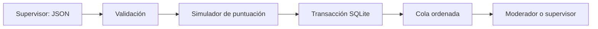

# Paso 4: carga de comentarios y cola priorizada

## Qué ocurre ahora

Un supervisor envía un lote de comentarios. El backend comprueba cada entrada,
asigna una puntuación **simulada**, y guarda el lote completo en SQLite. Un
moderador o supervisor puede consultar una cola paginada. La cola nunca devuelve
el texto: la lectura del contenido para revisión humana llegará en el paso de
revisión, con permisos y trazabilidad propios.

Este scorer es deliberadamente provisional: `SimulatedScorer` produce valores
deterministas para el demo, pero no mide toxicidad ni sustituye un modelo
entrenado. La API no usa todavía el dataset local ni un artefacto de
DistilBERT. El dataset de entrenamiento, cuando esté disponible, permanece
fuera de Git y debe pasarse explícitamente al script del modelo.



## Responsabilidad de cada archivo

| Archivo | Responsabilidad |
| --- | --- |
| `backend/app/comments/schemas.py` | Reglas de entrada y forma exacta de las respuestas |
| `backend/app/comments/router.py` | Rutas, permisos y códigos HTTP |
| `backend/app/comments/service.py` | Puntuar el lote antes de guardarlo |
| `backend/app/comments/scoring.py` | Contrato intercambiable `score_comment(text)` y simulador |
| `backend/app/comments/repository.py` | Transacción, consultas y orden estable |
| `backend/app/database.py` | Migración de esquema 2 a 3 y puntuación de filas anteriores |

La **ruta** habla HTTP; el **servicio** coordina la regla de negocio; el
**repositorio** habla SQL. Así, cuando exista un modelo evaluado, se sustituirá
el adaptador de puntuación sin cambiar el contrato de la cola.

## Probarlo en Swagger

Desde la raíz del proyecto, prepara el entorno y los usuarios si todavía no lo
hiciste en el paso 3:

```powershell
python -m venv .venv
.\.venv\Scripts\python.exe -m pip install -c backend/constraints.txt -e '.[dev]'
.\.venv\Scripts\python.exe -m app.seed_demo_users
.\.venv\Scripts\python.exe -m uvicorn app.main:create_app --factory --reload --host 127.0.0.1 --port 8000
```

1. Abre <http://127.0.0.1:8000/docs>, inicia sesión con `supervisor` en
   `POST /auth/login` y coloca `access_token` en **Authorize**.
2. Ejecuta `POST /comments/import` con este lote **sintético**:

```json
{
  "items": [
    {"comment_id": "demo-1", "video_id": "video-demo", "text": "Synthetic comment one"},
    {"comment_id": "demo-2", "video_id": "video-demo", "text": "Synthetic comment two"}
  ]
}
```

3. La respuesta `201` muestra `{"imported":2}`. Ejecuta `GET /comments` con
   `page=1&page_size=1`: verás un elemento, `total=2` y `has_next=true`.
4. Pide `page=2&page_size=1`: verás el otro. Fíjate en `score_source`,
   `model_version` y `uncertainty`; no aparece `text`.
5. Repite el lote: recibe `409` y no se añade ninguna fila. Cambia un texto
   por espacios: recibe `422`. Inicia sesión como `moderator`: puede consultar
   `GET /comments`, pero `POST /comments/import` responde `403`.

La base local está en `data/local/moderation.db` por defecto y se excluye de Git.
No cargues comentarios reales ni un dataset sin resolver antes procedencia,
licencia y protección de datos.

### Resultado verificado

El flujo HTTP se comprobó localmente el 22 de septiembre de 2026 con tres
comentarios sintéticos y una SQLite temporal: `/health` respondió `200`, el
login de supervisor `200`, la importación `201`, la cola paginada respondió
`200` con páginas de 2 y 1 elementos, y el login de moderator respondió `200`.
Moderator pudo leer la cola (`200`) pero no importar (`403`); repetir el lote
devolvió `409` por comentario duplicado. El orden observado fue `demo-b`,
`demo-a`, `demo-c`; depende del scorer simulado y no representa toxicidad.

Esta verificación no conecta DistilBERT ni ningún otro modelo entrenado. La API
mantiene `SimulatedScorer` hasta que exista un adaptador de modelo aprobado; las
limitaciones y el overfitting del Transformer están documentados en
`docs/model/transformer.md`.

## Cómo funciona la validación

Cada lote admite de 1 a 1000 comentarios. `comment_id` y `video_id` tienen
entre 1 y 128 caracteres; `text`, entre 1 y 5000. Se quitan espacios exteriores
y se rechazan valores vacíos, campos adicionales e ID repetidos en el mismo lote.
Un ID ya existente da `409`. Todo el lote se confirma en una transacción; si
falla una inserción, SQLite revierte también las anteriores de ese lote.

El JSON usa nombres de API en `snake_case`. Los campos `CommentId`, `VideoId` y
`Text` del documento de referencia se mapearían a `comment_id`, `video_id` y
`text` en un futuro importador de archivos. La API no acepta etiquetas como
`IsToxic`: son resultados de entrenamiento, no datos de entrada para inferencia.

## Qué significa la puntuación

`SimulatedScorer` transforma el texto en un número estable mediante SHA-256.
Sirve únicamente para ejercitar el orden y el contrato del futuro modelo. **No
mide toxicidad ni estima una probabilidad válida.** Por eso cada fila dice
`score_source: SIMULATED`, `model_version: simulated-v1` y `uncertainty: 1.0`.
La cola ordena de mayor a menor `risk_score`; en empates conserva el orden de
entrada con una secuencia de SQLite. El nombre `risk_score` anticipa el contrato
futuro, pero durante este paso su valor es arbitrario. No tomes decisiones de
moderación a partir de él.

## Paginación y límites de esta entrega

`page` empieza en 1; `page_size` va de 1 a 100 y vale 20 por defecto. `total`
cuenta los comentarios pendientes. Si se insertan comentarios entre dos
peticiones, la paginación por desplazamiento puede repetir o saltar una fila;
un cursor resolverá esto cuando necesitemos ingestión concurrente. La cola
filtra `PENDING`; las transiciones de revisión llegarán en el siguiente paso.

El arranque migra bases de versión 2 a 3 sin borrar usuarios, sesiones ni
comentarios. A los comentarios existentes se les asigna la misma puntuación
simulada para que aparezcan en la cola. Antes
de volver a una versión anterior del código, haz una copia de la base: el código
anterior rechaza una versión de esquema que todavía no conoce. El texto permanece
en SQLite local para la futura revisión, pero no viaja en la respuesta de cola.
Para producción faltan una política de retención, cifrado y control operativo del
archivo, así como un modelo entrenado y evaluado.

## Ejercicio de arquitectura

Localiza una petición en este orden: `router.import_comments` →
`CommentService.import_items` → `SimulatedScorer.score_comment` →
`CommentRepository.insert_batch`. Luego sigue `GET /comments` desde la ruta
hasta `CommentRepository.page`. Cambia únicamente el orden de los comentarios
del JSON y observa que el desempate conserva ese orden. Las pruebas ejecutables:

```powershell
.\.venv\Scripts\python.exe -m pytest backend/tests/test_comments.py -q
```
## Estado de la inferencia

La API carga el artefacto Logistic + TF-IDF generado por
`scripts/train_logistic_tfidf.py` sin reentrenar. Las filas conectadas contienen
`score_source: MODEL` y `model_version: logistic-tfidf-v1`. `risk_score` sirve para
priorizar revisión humana y `uncertainty` expresa ambigüedad del score; ninguno
es una decisión automática. El Transformer permanece fuera de producción.
`SimulatedScorer` solo se usa como fallback local cuando falta el artefacto y sus
valores no representan toxicidad real.
