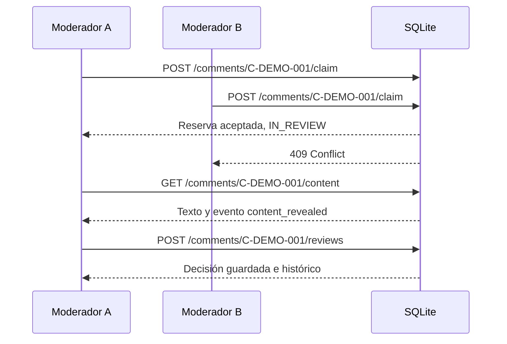

# Paso 5: revisión compartida e histórico

Este paso añade el primer recorrido persistente de un comentario: verlo en la
cola, reservarlo, mostrar su texto, registrar una decisión humana y consultar
el histórico. Usa la autenticación del paso 3 y el mismo archivo SQLite.

## El problema de dos moderadores

Una cola compartida puede mostrar el mismo comentario a varias personas. Si dos
lo abren casi al mismo tiempo, necesitamos decidir en el servidor quién lo
revisa. Ocultar el botón en una interfaz no evita la carrera entre peticiones.



`409 Conflict` significa que la petición era válida, pero el estado actual del
comentario impide hacerla. Si la reserva caduca mientras escribes la decisión,
el servidor devuelve `409`: hay que volver a la cola y tomar una nueva reserva.

## Preparar un ejemplo local

Abre PowerShell en la raíz de **este worktree**. Si todavía no tienes el entorno
de Python, créalo e instala el paquete:

```powershell
python -m venv .venv
.\.venv\Scripts\python.exe -m pip install -c backend/constraints.txt -e '.[dev]'
```

Carga los dos usuarios con contraseñas que elijas; el comando las pide sin
mostrarlas en pantalla:

```powershell
.\.venv\Scripts\python.exe -m app.seed_demo_users
```

Después carga tres comentarios **sintéticos**:

```powershell
.\.venv\Scripts\python.exe -m app.seed_demo_comments
```

El comando indica cuántos comentarios añadió. Si lo repites, los que ya
existían conservan su estado y sus decisiones. Sus puntuaciones son inventadas
para practicar el orden de la cola; `model_version=demo-simulated-v1` las
identifica como simuladas. Este comando no lee el dataset real.

Inicia la API en otra terminal, desde el mismo directorio:

```powershell
.\.venv\Scripts\python.exe -m uvicorn app.main:create_app --factory --reload --host 127.0.0.1 --port 8000
```

La base predeterminada está en `data/local/moderation.db`, fuera de Git. Si
ya contiene datos locales que quieras conservar, haz una copia del archivo
antes de arrancar esta versión: el inicio migra su esquema de versión 1 a 2.
Las cuentas y sesiones existentes permanecen en la misma base. Para utilizar
otra ruta, fija `MODERATION_DATABASE_PATH` tanto en los comandos de carga como
en el servidor.

## Recorrerlo en Swagger

Abre [Swagger](http://127.0.0.1:8000/docs):

1. Ejecuta `POST /auth/login` con `moderator` y la contraseña que introdujiste.
   Copia `access_token`, pulsa **Authorize** y pega el token en el campo Bearer.
2. Ejecuta `GET /comments`. Cada elemento muestra `comment_id`, `video_id`,
   `risk_score`, `model_version` y `status`. **No contiene el texto**.
3. Ejecuta `POST /comments/C-DEMO-001/claim`. La respuesta contiene
   `claim_expires_at`, un instante Unix en segundos. Desde ahora el comentario
   aparece como `IN_REVIEW` y sale de la cola `PENDING`.
4. Ejecuta `GET /comments/C-DEMO-001/content`. La respuesta contiene el texto.
   Esta revelación se registra, pero el texto no se copia al registro de auditoría.
5. Ejecuta `POST /comments/C-DEMO-001/reviews` con:

   ```json
   {
     "result": "NO_ESCALATION",
     "reason": "Reviewed the synthetic example; no escalation needed"
   }
   ```

6. Ejecuta otra vez `GET /comments`: el comentario ya no está pendiente.
7. Ejecuta `GET /comments/C-DEMO-001/history`: verás `assigned`,
   `content_revealed` y `classified`, con la identidad de quien actuó.
8. Ejecuta `GET /comments?status=CLASSIFIED` para localizar los casos cerrados.

Puedes repetir el recorrido con `C-DEMO-002` y el resultado
`ESCALATE_TO_SUPERVISOR`. Aparecerá como `ESCALATED`. Ese estado significa que
necesita el siguiente tratamiento humano; el supervisor todavía no lo ha resuelto.

## Reglas observables

| Petición | Condición | Resultado |
| --- | --- | --- |
| `GET /comments` | Sesión válida | Cola sin texto; mayor riesgo primero, empates por orden de entrada |
| `POST /comments/{id}/claim` | Comentario `PENDING` | Una reserva durante 15 minutos |
| Segundo `claim` | Reserva activa o decisión terminada | `409` |
| `GET /comments/{id}/content` | Quien tiene la reserva | Texto y evento de revelación |
| `GET content` de otra persona | Reserva ajena | `403`, sin texto |
| `POST /comments/{id}/reviews` | Titular, reserva vigente, motivo no vacío | Decisión, estado y evento persistentes |
| `GET /comments/{id}/history` | Sesión válida | Eventos ordenados y atribución, sin el campo de texto original |

Una sesión ausente o caducada recibe `401`. Un id inexistente recibe `404`.
El servidor consulta el rol y la sesión en cada petición, por lo que un campo
`role` inventado en el frontend no da acceso.

Los cuatro resultados iniciales se guardan sin sobrescribir decisiones:

| `result` | Estado tras guardar | Evento |
| --- | --- | --- |
| `NO_ESCALATION` | `CLASSIFIED` | `classified` |
| `ESCALATE_TO_SUPERVISOR` | `ESCALATED` | `escalated` |
| `INSUFFICIENT_CONTEXT` | `ESCALATED` | `escalated` |
| `TRANSFER_REQUESTED` | `ESCALATED` | `escalated` |

La revisión guarda una copia de `model_score` y `model_version`, además de
`reviewer_id`, nombre mostrado, motivo y fecha. Así el histórico sigue diciendo
qué información tenía la persona cuando decidió, incluso si cambia la
predicción de un comentario más adelante.

## Cómo se evita la doble reserva

`backend/app/comments/router.py` convierte HTTP en llamadas al servicio.
`service.py` decide cómo cambia el estado para cada resultado. `repository.py`
ejecuta las operaciones SQL como una sola **transacción**: o se guardan juntas
la reserva, el estado y el evento, o no se guarda ninguna.

El repositorio ejecuta `BEGIN IMMEDIATE` antes de comprobar `PENDING`.
SQLite deja que un escritor tome el turno y el otro espere; al llegar su turno,
el segundo ya ve `IN_REVIEW` y recibe `409`. La base añade otro control: un
índice único parcial permite solo una asignación abierta por comentario.
El reloj se consulta después de obtener el bloqueo. Si una petición estuvo
esperando y la reserva venció durante esa espera, se evalúa con la hora actual.

Una reserva abandonada vence después de 15 minutos. La próxima consulta de
cola o intento de reserva la cierra, añade `claim_expired` al histórico y
devuelve el comentario a `PENDING`. Esto funciona incluso tras reiniciar el
servidor, porque el vencimiento está en SQLite. El TTL no se renueva al mostrar
el texto: conviene que el frontend avise a la persona del tiempo restante.

## Privacidad y límites

La cola, el historial y `audit_events` no copian el campo original de texto.
`GET content` exige la reserva y usa `Cache-Control: no-store`. El histórico
también exige login y tiene esa cabecera. **El motivo lo escribe una persona**:
si copia palabras del comentario dentro de `reason`, esas palabras aparecerán
en la decisión y su histórico. No pongas datos personales innecesarios ahí.

La decisión humana no elimina comentarios, no sanciona usuarios y no llama a
YouTube. La reapertura, reasignación y resolución del supervisor corresponden
al paso 6. La marca visual reversible del MVP es una idea diferente de la
decisión persistente de esta API.

## Comprobar las pruebas

```powershell
.\.venv\Scripts\python.exe -m pytest backend/tests/test_review.py -q
.\.venv\Scripts\python.exe -m pytest -q
```

Las pruebas crean bases SQLite aisladas y comprueban una migración desde la
versión 1, una carrera entre dos instancias de la API, caducidad de reservas,
permisos, los cuatro resultados y la ausencia del texto original en auditoría.
Si Windows restringe la carpeta temporal, añade
`--basetemp=.pytest_cache/review-temp`; pytest vaciará esa carpeta de prueba.

El contrato y las decisiones de arquitectura están en
[`openspec/changes/backend-review-history/`](../../openspec/changes/backend-review-history/).
