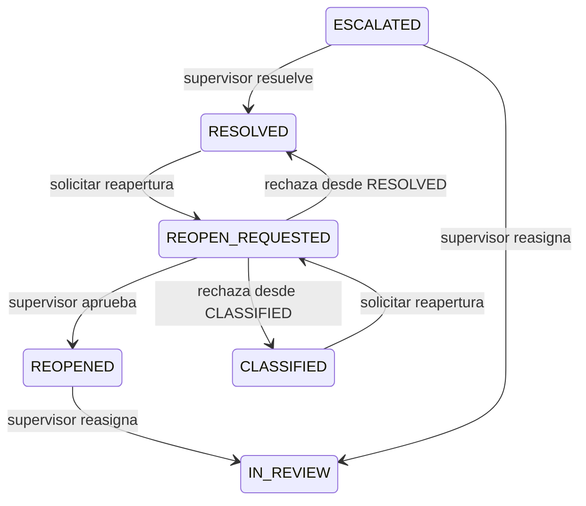

# Paso 6: supervisión y reapertura controlada

En el paso 5 guardamos decisiones humanas sin sobrescribirlas. Ahora un
supervisor puede resolver casos escalados, asignarlos a otra persona y decidir
si un caso cerrado merece otra revisión.

## La regla principal

El servidor consulta el rol guardado en SQLite en cada petición. Una persona
`MODERATOR` puede solicitar una reapertura; únicamente `SUPERVISOR` puede
aprobarla, rechazarla, pedir aclaraciones o reasignar. Una sesión ausente da
`401` y un moderador que llama una ruta de supervisor recibe `403`.



Una solicitud pendiente mantiene el comentario fuera de la cola general.
Si el supervisor pide aclaraciones, la solicitud pasa a `NEEDS_INFO`, mientras
el comentario permanece en `REOPEN_REQUESTED`. La persona que solicitó la
reapertura responde y la solicitud vuelve a `PENDING`. La aprobación deja el
comentario en `REOPENED`; exige una nueva asignación del supervisor antes de
otra revisión.

## Archivos y arquitectura

| Archivo | Responsabilidad |
| --- | --- |
| `backend/app/database.py` | Migra SQLite de versión 2 o 3 a 4 sin borrar decisiones |
| `backend/app/supervision/schemas.py` | Valida peticiones y define respuestas |
| `backend/app/supervision/router.py` | Exige rol de supervisor en HTTP |
| `backend/app/comments/router.py` | Recibe solicitudes del personal |
| `backend/app/supervision/service.py` | Presenta los casos de uso |
| `backend/app/supervision/repository.py` | Aplica cambios atómicos en SQLite |

`reopen_requests` conserva la solicitud, su estado anterior y la decisión.
`reopen_updates` registra cada pregunta y respuesta; `supervisor_actions`
conserva resoluciones y reasignaciones. `audit_events` registra actor, tiempo,
tipo de evento y referencias a esas filas. No copia el texto del comentario.
El histórico une las tablas para mostrar los motivos al personal autenticado.
Un motivo escrito por una persona sí puede incluir información sensible; evita
copiar datos personales innecesarios en esos campos.

Cada operación usa una transacción `BEGIN IMMEDIATE`: comprueba el estado y
guarda todos los cambios juntos. Si otra operación ya cambió el estado, la
petición recibe `409 Conflict`. Así dos supervisores no pueden aprobar y
rechazar la misma solicitud a la vez.

## Preparar la demo local

Abre PowerShell en la raíz de este worktree. Si ya tienes datos locales
valiosos en `data/local/moderation.db`, haz una copia antes de iniciar esta
versión: la migración a versión 4 no se revierte automáticamente.

```powershell
python -m venv .venv
.\.venv\Scripts\python.exe -m pip install -c backend/constraints.txt -e '.[dev]'
.\.venv\Scripts\python.exe -m app.seed_demo_users
.\.venv\Scripts\python.exe -m app.seed_demo_comments
.\.venv\Scripts\python.exe -m uvicorn app.main:create_app --factory --reload --host 127.0.0.1 --port 8000
```

El comando de usuarios pide contraseñas sin mostrarlas y conserva las cuentas
existentes. Los comentarios son sintéticos; sus puntuaciones no son evidencia
de un modelo evaluado. Abre [Swagger](http://127.0.0.1:8000/docs), haz login
como `moderator` y autoriza el token Bearer.

## Ejercicio A: resolver un escalado

Sigue [el paso 5](05-revision-e-historico.md) para reservar `C-DEMO-002` y
enviar `ESCALATE_TO_SUPERVISOR` con un motivo. Luego inicia sesión como
`supervisor`, cambia el token y consulta `GET /supervisor/escalations`.
Ejecuta `POST /supervisor/comments/C-DEMO-002/resolve`:

```json
{"reason":"Supervisor reviewed this synthetic case","recommend_removal":false}
```

Verás `RESOLVED` y un evento `resolved` en `GET /comments/C-DEMO-002/history`.
`recommend_removal=true` solo guarda una recomendación local. La API no
elimina contenido ni contacta YouTube.

## Ejercicio B: solicitar y aprobar reapertura

Como moderador, clasifica `C-DEMO-001` mediante `NO_ESCALATION`. Luego llama a
`POST /comments/C-DEMO-001/reopen-requests`:

```json
{"reason":"New context may change the assessment","optional_note":"Synthetic follow-up"}
```

Guarda el `request_id` de la respuesta. El comentario ya no vuelve a
`GET /comments`, que muestra solo `PENDING`. Como supervisor, consulta
`GET /supervisor/reopen-requests?status=PENDING` y ejecuta
`POST /supervisor/reopen-requests/{request_id}/approve`:

```json
{"reason":"Allow a second human review"}
```

El estado pasa a `REOPENED`. Obtén el `id` de la persona destinataria con su
sesión en `GET /auth/me`. Como supervisor, ejecuta
`POST /supervisor/comments/C-DEMO-001/reassign`:

```json
{"reviewer_id":"id-devuelto-por-auth-me","reason":"Second review"}
```

La nueva asignación dura 15 minutos. Su titular puede revelar el texto y
decidir. El histórico conservará la primera revisión, solicitud, aprobación,
reasignación y segunda revisión. Si reasignas un caso que estaba `IN_REVIEW`,
la persona anterior pierde el derecho a decidir. Si esa asignación vence,
el comentario vuelve a `ESCALATED` o `REOPENED` y permanece fuera de la
cola general hasta que un supervisor elija a otra persona.

Practica además `/reject`: restaura el estado cerrado que tenía el caso.
Con `/request-info`, el supervisor solicita información; la persona original
responde en `POST /comments/{id}/reopen-requests/{request_id}/information`.
Una persona distinta recibe `403`.

## Verificación y próximos pasos

```powershell
.\.venv\Scripts\python.exe -m pytest backend/tests/test_supervision.py -q
.\.venv\Scripts\python.exe -m pytest -q
```

Las pruebas usan SQLite real en archivos temporales y comprueban migración,
permisos, conflictos concurrentes, conservación de decisiones y auditoría sin
el texto original. El modelo real y la integración con frontend corresponden
al paso 7. Puedes leer el [contrato](../../openspec/changes/backend-supervision/specs/backend-supervision/spec.md)
y las [decisiones técnicas](../../openspec/changes/backend-supervision/design.md).
